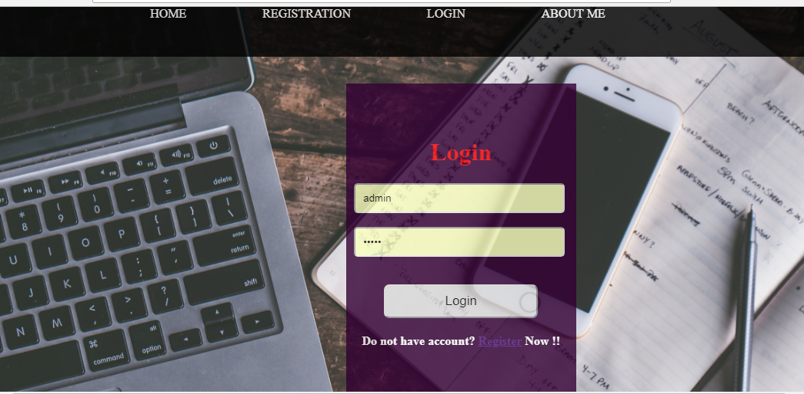
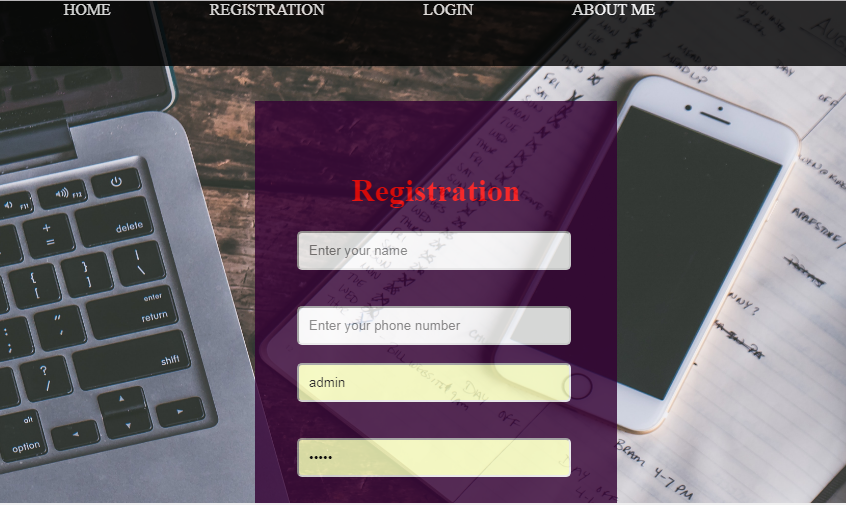
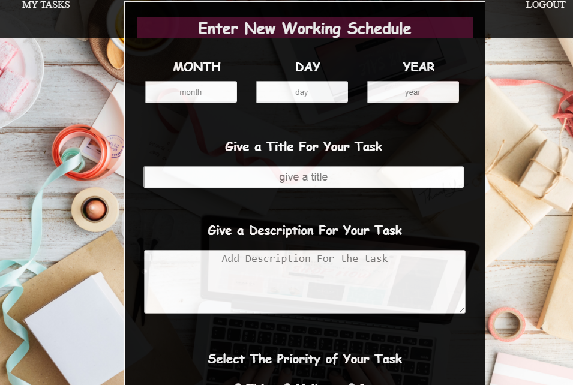
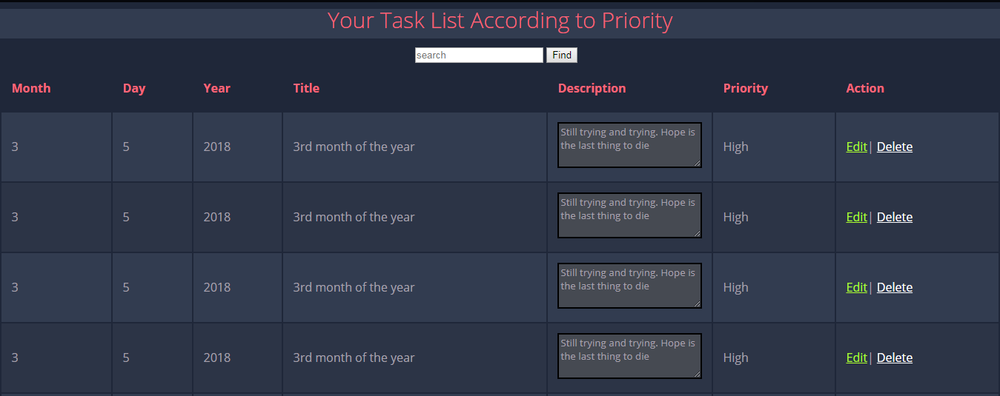

# Screen Shots 
 

# Project Title
TO_DO_LIST

## Description

A very simple web app to keep track your busy schedule.The following module we can achive from the web app.
  * A user can Register him self by providing some information.
  * User must login with valid cradentials to use the app
  * A user can enlist a task according to date.
  * User can set priority (High, Midium, Low)  at his task.
  * User search through his tasks.
  * User can view his/her task list according to priority. 
  * User can Edit his/her enlisted task anytime.
  * User can Delete his/her task.
  * User can Update his/her task.

## Technology I have used
  ### Front End
     * jsp 
     * HTML, CSS, JavaScript
     * JSTL.
  ### Back End
     * java
  ### Frame Work
     * Spring MVC
  ### Database
     * MySql
     * H2 database engine.
     * Spring Jdbc Template.
  ### IDE
     * Netbeans (8.2)
  ### Build Tool
     * Maven
     
  ### Version control
     * GitHub
  ### Server
     * Apache Tomcat (7)
  ## For Video Preview
  https://youtu.be/RT58bW-wIR8
 

## Acknowledgments

* Durga Soft
* Vikram Thakur

